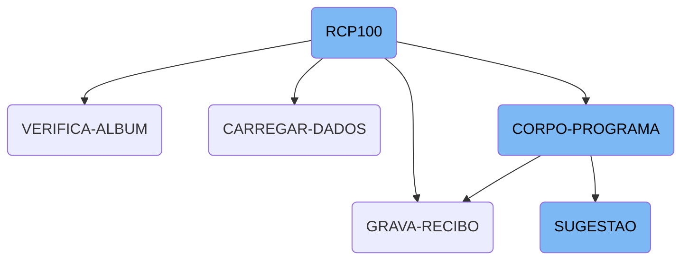
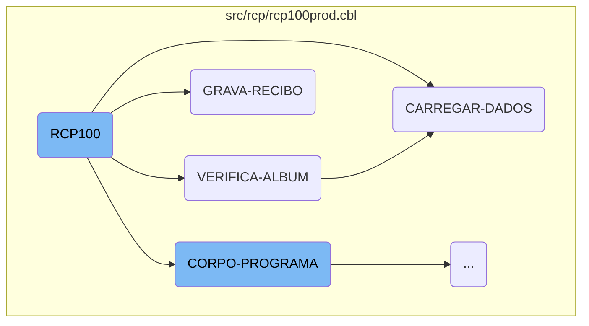
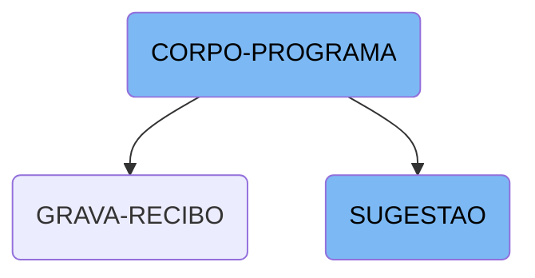

In this document, we will explore the <SwmToken path="src/rcp/rcp100prod.cbl" pos="3:6:6" line-data="       PROGRAM-ID. RCP100.">`RCP100`</SwmToken> program, which is a central component of the Kello Imagens system. The program is responsible for initializing the main process flow, verifying album details, loading necessary data, recording receipts, and handling various program conditions.

The <SwmToken path="src/rcp/rcp100prod.cbl" pos="3:6:6" line-data="       PROGRAM-ID. RCP100.">`RCP100`</SwmToken> program starts by initializing the main process flow. It then verifies album details to ensure that the album exists and the user has the required permissions. After that, it loads necessary data related to the album, such as movement date, tax, and vendor details. The program then records the receipt data to the database, ensuring data integrity. Throughout the process, it evaluates various conditions and performs corresponding actions, such as centralizing data, creating list views, saving receipts, and providing suggestions based on different criteria.

Here is a high level diagram of the flow, showing only the most important functions:



# Flow drill down

First, we'll zoom into this section of the flow:



<SwmSnippet path="/src/rcp/rcp100prod.cbl" line="313">

---

## <SwmToken path="src/rcp/rcp100prod.cbl" pos="3:6:6" line-data="       PROGRAM-ID. RCP100.">`RCP100`</SwmToken>

The <SwmToken path="src/rcp/rcp100prod.cbl" pos="3:6:6" line-data="       PROGRAM-ID. RCP100.">`RCP100`</SwmToken> function initializes the program and sets up the main process flow by calling the <SwmToken path="src/rcp/rcp100prod.cbl" pos="314:3:5" line-data="           PERFORM INICIALIZA-PROGRAMA.">`INICIALIZA-PROGRAMA`</SwmToken> section.

```cobol
       MAIN-PROCESS SECTION.
           PERFORM INICIALIZA-PROGRAMA.
```

---

</SwmSnippet>

<SwmSnippet path="/src/rcp/rcp100prod.cbl" line="1646">

---

## <SwmToken path="src/rcp/rcp100prod.cbl" pos="1646:1:3" line-data="       VERIFICA-ALBUM SECTION.">`VERIFICA-ALBUM`</SwmToken>

The <SwmToken path="src/rcp/rcp100prod.cbl" pos="1646:1:3" line-data="       VERIFICA-ALBUM SECTION.">`VERIFICA-ALBUM`</SwmToken> function checks the album details, validates user permissions, and loads necessary data. It ensures that the album exists and the user has the required permissions to proceed.

```cobol
       VERIFICA-ALBUM SECTION.
           CLOSE       WORK
           OPEN OUTPUT WORK
           CLOSE       WORK
           OPEN I-O    WORK

           MOVE ZEROS                      TO TOT-PARCELA
                                              GS-FLAG-CRITICA
           MOVE GS-NR-ALBUM                TO ALBUM-REC(1: 4)
           MOVE GS-NR-FORM                 TO ALBUM-REC(5: 4)
           MOVE GS-SEQ                     TO SEQ-REC
           READ RCD100 INVALID KEY
                MOVE GS-NR-ALBUM           TO NR-ALBUM-W
                MOVE GS-NR-FORM            TO NR-FORM-W
                MOVE GS-SEQ                TO SEQ-W
                MOVE GS-VENDEDOR           TO VENDEDOR-W
                PERFORM LIMPAR-DADOS
                MOVE NR-ALBUM-W            TO GS-NR-ALBUM
                                              ALBUM-REC(1: 4)
                MOVE NR-FORM-W             TO GS-NR-FORM
                                              ALBUM-REC(5: 4)
```

---

</SwmSnippet>

<SwmSnippet path="/src/rcp/rcp100prod.cbl" line="1753">

---

## <SwmToken path="src/rcp/rcp100prod.cbl" pos="1753:1:3" line-data="       CARREGAR-DADOS SECTION.">`CARREGAR-DADOS`</SwmToken>

The <SwmToken path="src/rcp/rcp100prod.cbl" pos="1753:1:3" line-data="       CARREGAR-DADOS SECTION.">`CARREGAR-DADOS`</SwmToken> function loads data related to the album, such as movement date, tax, and vendor details. It also performs necessary data transformations and validations.

```cobol
       CARREGAR-DADOS SECTION.
           MOVE DATA-MOVTO-REC       TO DATA-INV.
           CALL "GRIDAT1" USING DATA-INV
           MOVE DATA-INV             TO GS-DATA-MOVTO
           MOVE TAXA-REC             TO GS-TAXA
           MOVE DATAVEN-REC          TO DATA-INV
           CALL "GRIDAT1" USING DATA-INV
           MOVE DATA-INV             TO GS-DATA-VENDA
           MOVE VISITA-REC           TO GS-VISITA
           MOVE CHAVE-ALBUM-REC      TO ALBUM-MTG
           READ MTD020 INVALID KEY
                MOVE ZEROS           TO VISITA-MTG
           END-READ
           MOVE VISITA-MTG           TO GS-COD-COMISS
           IF FOGO-MTG = 9
              MOVE 8 TO FOGO-MTG
           ELSE
              MOVE 1 TO FOGO-MTG
           END-IF
           MOVE VENDEDOR-REC         TO GS-VENDEDOR
                                        CODIGO-CG01
```

---

</SwmSnippet>

<SwmSnippet path="/src/rcp/rcp100prod.cbl" line="2312">

---

## <SwmToken path="src/rcp/rcp100prod.cbl" pos="2312:1:3" line-data="       GRAVA-RECIBO SECTION.">`GRAVA-RECIBO`</SwmToken>

The <SwmToken path="src/rcp/rcp100prod.cbl" pos="2312:1:3" line-data="       GRAVA-RECIBO SECTION.">`GRAVA-RECIBO`</SwmToken> function handles the receipt recording process. It writes the receipt data to the database, ensuring data integrity and handling any errors that may occur during the write operation.

```cobol
       GRAVA-RECIBO SECTION.
           CLOSE    RCD100 RCD100P
           OPEN I-O RCD100 RCD100P

           MOVE ZEROS TO NR-PARCELA.
           MOVE GS-NR-ALBUM          TO ALBUM-REC(1: 4)
           MOVE GS-NR-FORM           TO ALBUM-REC(5: 4)
           MOVE GS-SEQ               TO SEQ-REC

           MOVE GS-DATA-MOVTO        TO DATA-INV.
           CALL "GRIDAT2" USING DATA-INV
           MOVE DATA-INV             TO DATA-MOVTO-REC
           MOVE GS-TAXA              TO TAXA-REC
           MOVE GS-DATA-VENDA        TO DATA-INV
           CALL "GRIDAT2" USING DATA-INV
           MOVE DATA-INV             TO DATAVEN-REC
           MOVE GS-VISITA            TO VISITA-REC
           MOVE GS-VENDEDOR          TO VENDEDOR-REC
           MOVE GS-TOT-VENDA         TO TOTAL-REC
           MOVE GS-TOT-PM            TO PM-REC
           MOVE GS-TOT-VENDA-DEF     TO TOTAL-DEF-REC
```

---

</SwmSnippet>

Now, lets zoom into this section of the flow:



<SwmSnippet path="/src/rcp/rcp100prod.cbl" line="582">

---

## <SwmToken path="src/rcp/rcp100prod.cbl" pos="582:1:3" line-data="       CORPO-PROGRAMA SECTION.">`CORPO-PROGRAMA`</SwmToken>

The <SwmToken path="src/rcp/rcp100prod.cbl" pos="582:1:3" line-data="       CORPO-PROGRAMA SECTION.">`CORPO-PROGRAMA`</SwmToken> section evaluates various conditions and performs corresponding actions. It handles tasks such as centralizing data, creating list views, saving receipts, clearing data, and more. Each condition is checked using the <SwmToken path="src/rcp/rcp100prod.cbl" pos="583:1:3" line-data="           EVALUATE TRUE">`EVALUATE TRUE`</SwmToken> statement, and specific actions are performed based on the evaluation results. For example, if <SwmToken path="src/rcp/rcp100prod.cbl" pos="584:3:7" line-data="               WHEN GS-CENTRALIZA-TRUE">`GS-CENTRALIZA-TRUE`</SwmToken> is true, it performs the <SwmToken path="src/rcp/rcp100prod.cbl" pos="585:3:3" line-data="                    PERFORM CENTRALIZAR">`CENTRALIZAR`</SwmToken> action. Similarly, if <SwmToken path="src/rcp/rcp100prod.cbl" pos="617:3:7" line-data="               WHEN GS-SUGESTAO-TRUE">`GS-SUGESTAO-TRUE`</SwmToken> is true, it performs the <SwmToken path="src/mtp/mtp021novo.cbl" pos="903:1:1" line-data="       SUGESTAO SECTION.">`SUGESTAO`</SwmToken> action.

```cobol
       CORPO-PROGRAMA SECTION.
           EVALUATE TRUE
               WHEN GS-CENTRALIZA-TRUE
                    PERFORM CENTRALIZAR
                    PERFORM CRIAR-LISTVIEW-PRODUTOS
                    PERFORM CRIAR-LISTVIEW-PAGTO
               WHEN GS-CONFERE-RECIBO-TRUE
                    PERFORM CONFERE-RECIBO
               WHEN GS-SAVE-FLG-TRUE
                    PERFORM GRAVA-RECIBO
                    PERFORM LIMPAR-DADOS
               WHEN GS-EXCLUI-FLG-TRUE
                    PERFORM EXCLUI
                    PERFORM LIMPAR-DADOS
               WHEN GS-INCLUI-CHEQUE-TRUE
                    PERFORM GRAVAR-CHEQUE-WORK
                    PERFORM MOSTRAR-COLUNAS-FAVOPAGTO
                    PERFORM MOSTRAR-FONTE-FAVOPAGTO
                    PERFORM ZEBRAR-ITENSPAGTO
               WHEN GS-ADICIONA-CHEQUE-TRUE
                    PERFORM GRAVAR-CHEQUE-WORK
```

---

</SwmSnippet>

<SwmSnippet path="/src/mtp/mtp021novo.cbl" line="903">

---

## SUGESTAO

The <SwmToken path="src/mtp/mtp021novo.cbl" pos="903:1:1" line-data="       SUGESTAO SECTION.">`SUGESTAO`</SwmToken> section evaluates the <SwmToken path="src/mtp/mtp021novo.cbl" pos="904:3:7" line-data="           EVALUATE GS-CAMPO-CRITICA">`GS-CAMPO-CRITICA`</SwmToken> field and performs specific suggestion actions based on its value. For instance, if <SwmToken path="src/mtp/mtp021novo.cbl" pos="904:3:7" line-data="           EVALUATE GS-CAMPO-CRITICA">`GS-CAMPO-CRITICA`</SwmToken> is <SwmToken path="src/mtp/mtp021novo.cbl" pos="905:4:6" line-data="               WHEN &quot;EF-CONTRATO&quot;      PERFORM SUGESTAO-CONTRATO">`EF-CONTRATO`</SwmToken>, it performs the <SwmToken path="src/mtp/mtp021novo.cbl" pos="905:11:13" line-data="               WHEN &quot;EF-CONTRATO&quot;      PERFORM SUGESTAO-CONTRATO">`SUGESTAO-CONTRATO`</SwmToken> action. This section is responsible for providing suggestions based on different criteria such as contracts, albums, products, models, and suppliers.

```cobol
       SUGESTAO SECTION.
           EVALUATE GS-CAMPO-CRITICA
               WHEN "EF-CONTRATO"      PERFORM SUGESTAO-CONTRATO
               WHEN "EF-ALBUM"         PERFORM SUGESTAO-ALBUM
               WHEN "EF-PRODUTO"       PERFORM SUGESTAO-PRODUTO
               WHEN "EF-MODELO"        PERFORM SUGESTAO-PRODUTO
               WHEN "EF-FORNECEDOR"    PERFORM SUGESTAO-FORNECEDOR
           END-EVALUATE.
```

---

</SwmSnippet>

&nbsp;

*This is an auto-generated document by Swimm AI 🌊 and has not yet been verified by a human*

<SwmMeta version="3.0.0" repo-id="Z2l0aHViJTNBJTNBa2VsbG8lM0ElM0Fzd2ltbWlv" repo-name="kello"><sup>Powered by [Swimm](/)</sup></SwmMeta>
