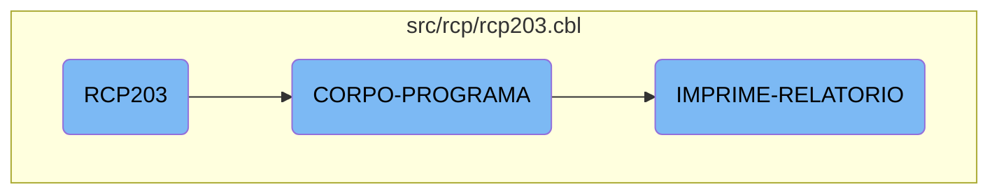

In this document, we will explain the flow of the <SwmToken path="src/rcp/rcp203.cbl" pos="3:6:6" line-data="       PROGRAM-ID. RCP203.">`RCP203`</SwmToken> program. The program initializes by accepting parameters from the command line, processes the core logic based on various conditions, and prints reports if required.

The flow starts with the program initializing by accepting parameters from the command line. Then, it enters the core logic section where it checks different conditions and performs actions like centralizing data, verifying status, and printing reports. If the flag for printing reports is set, it will handle the printing of reports until the required number of copies is reached.

# Flow drill down



<SwmSnippet path="/src/rcp/rcp203.cbl" line="539">

---

## <SwmToken path="src/rcp/rcp203.cbl" pos="3:6:6" line-data="       PROGRAM-ID. RCP203.">`RCP203`</SwmToken>

The <SwmToken path="src/rcp/rcp203.cbl" pos="3:6:6" line-data="       PROGRAM-ID. RCP203.">`RCP203`</SwmToken> function initializes the program by accepting parameters from the command line. This sets up the necessary environment for the subsequent operations.

```cobol
       MAIN-PROCESS SECTION.
           PERFORM INICIALIZA-PROGRAMA.
           PERFORM CORPO-PROGRAMA UNTIL GS-EXIT-FLG-TRUE.
           GO FINALIZAR-PROGRAMA.

       INICIALIZA-PROGRAMA SECTION.
           ACCEPT PARAMETROS-W FROM COMMAND-LINE.
```

---

</SwmSnippet>

<SwmSnippet path="/src/rcp/rcp203.cbl" line="650">

---

## <SwmToken path="src/rcp/rcp203.cbl" pos="650:1:3" line-data="       CORPO-PROGRAMA SECTION.">`CORPO-PROGRAMA`</SwmToken>

The <SwmToken path="src/rcp/rcp203.cbl" pos="650:1:3" line-data="       CORPO-PROGRAMA SECTION.">`CORPO-PROGRAMA`</SwmToken> function is the core logic of the flow. It evaluates various conditions and performs corresponding actions such as centralizing data, verifying status, printing reports, and handling pop-ups. This function orchestrates the main operations based on the flags set in the program.

```cobol
       CORPO-PROGRAMA SECTION.
           EVALUATE TRUE
               WHEN GS-CENTRALIZA-TRUE
                    PERFORM CENTRALIZAR
                    PERFORM VERIFICAR-SENHA-STATUS
               WHEN GS-PRINTER-FLG-TRUE
                    COPY IMPRESSORA.CHAMA.
                    IF LNK-MAPEAMENTO <> SPACES
                       PERFORM IMPRIME-RELATORIO
                    END-IF
               WHEN GS-GRAVA-WORK-FLG-TRUE
                    PERFORM GRAVA-WORK
                    PERFORM CARREGA-LISTA
                    PERFORM CARREGA-LISTA1
                    PERFORM CARREGA-LISTA5
               WHEN GS-CARREGA-LISTA-FLG-TRUE
                    PERFORM CARREGA-LISTA
                    PERFORM CARREGA-LISTA1
                    PERFORM CARREGA-LISTA5
               WHEN GS-POPUP-CONTRATO-TRUE
                    PERFORM CHAMAR-POPUP-CONTRATO
```

---

</SwmSnippet>

<SwmSnippet path="/src/rcp/rcp203.cbl" line="652">

---

### Centralizing Data

If the <SwmToken path="src/rcp/rcp203.cbl" pos="652:3:7" line-data="               WHEN GS-CENTRALIZA-TRUE">`GS-CENTRALIZA-TRUE`</SwmToken> flag is set, the <SwmToken path="src/rcp/rcp203.cbl" pos="541:3:5" line-data="           PERFORM CORPO-PROGRAMA UNTIL GS-EXIT-FLG-TRUE.">`CORPO-PROGRAMA`</SwmToken> function performs the <SwmToken path="src/rcp/rcp203.cbl" pos="653:3:3" line-data="                    PERFORM CENTRALIZAR">`CENTRALIZAR`</SwmToken> section, which centralizes the data.

```cobol
               WHEN GS-CENTRALIZA-TRUE
                    PERFORM CENTRALIZAR
                    PERFORM VERIFICAR-SENHA-STATUS
```

---

</SwmSnippet>

<SwmSnippet path="/src/rcp/rcp203.cbl" line="655">

---

### Printing Reports

If the <SwmToken path="src/rcp/rcp203.cbl" pos="655:3:9" line-data="               WHEN GS-PRINTER-FLG-TRUE">`GS-PRINTER-FLG-TRUE`</SwmToken> flag is set, the <SwmToken path="src/rcp/rcp203.cbl" pos="541:3:5" line-data="           PERFORM CORPO-PROGRAMA UNTIL GS-EXIT-FLG-TRUE.">`CORPO-PROGRAMA`</SwmToken> function includes the <SwmToken path="src/rcp/rcp203.cbl" pos="658:3:5" line-data="                       PERFORM IMPRIME-RELATORIO">`IMPRIME-RELATORIO`</SwmToken> section, which handles the printing of reports.

```cobol
               WHEN GS-PRINTER-FLG-TRUE
                    COPY IMPRESSORA.CHAMA.
                    IF LNK-MAPEAMENTO <> SPACES
                       PERFORM IMPRIME-RELATORIO
                    END-IF
```

---

</SwmSnippet>

<SwmSnippet path="/src/rcp/rcp203.cbl" line="2786">

---

## <SwmToken path="src/rcp/rcp203.cbl" pos="2786:1:3" line-data="       IMPRIME-RELATORIO SECTION.">`IMPRIME-RELATORIO`</SwmToken>

The <SwmToken path="src/rcp/rcp203.cbl" pos="2786:1:3" line-data="       IMPRIME-RELATORIO SECTION.">`IMPRIME-RELATORIO`</SwmToken> function is responsible for printing the report. It performs the <SwmToken path="src/rcp/rcp203.cbl" pos="2790:3:3" line-data="               PERFORM IMPRIMIR">`IMPRIMIR`</SwmToken> section repeatedly until the required number of copies (<SwmToken path="src/rcp/rcp203.cbl" pos="2788:9:11" line-data="           PERFORM UNTIL QUANTIDADE = GS-COPIAS">`GS-COPIAS`</SwmToken>) is reached.

```cobol
       IMPRIME-RELATORIO SECTION.
           MOVE 0 TO QUANTIDADE
           PERFORM UNTIL QUANTIDADE = GS-COPIAS
               ADD 1 TO QUANTIDADE
               PERFORM IMPRIMIR
           END-PERFORM.
```

---

</SwmSnippet>

&nbsp;

*This is an auto-generated document by Swimm AI 🌊 and has not yet been verified by a human*

<SwmMeta version="3.0.0" repo-id="Z2l0aHViJTNBJTNBa2VsbG8lM0ElM0Fzd2ltbWlv" repo-name="kello"><sup>Powered by [Swimm](/)</sup></SwmMeta>
