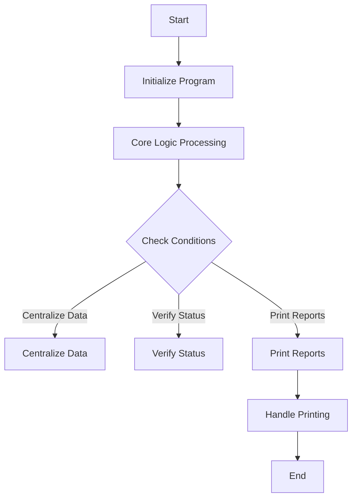

This document will cover the flow of the RCP203 program, which includes:

1. Initializing the program
2. Core logic processing
3. Printing reports.

Technical document: <SwmLink doc-title="RCP203 Program Flow">[RCP203 Program Flow](/.swm/rcp203-program-flow.ch8u4exc.sw.md)</SwmLink>

# Initializing the Program

The RCP203 program starts by initializing and accepting parameters from the command line. This step sets up the necessary environment for the subsequent operations. The parameters provided will dictate how the program behaves during its execution.

# Core Logic Processing

Once the program is initialized, it enters the core logic section. Here, the program evaluates various conditions and performs corresponding actions. These actions include centralizing data, verifying status, and printing reports. The core logic is the heart of the program, orchestrating the main operations based on the flags set in the program.

## Centralizing Data

If the flag for centralizing data (`GS-CENTRALIZA-TRUE`) is set, the program will centralize the data. This involves aggregating data from various sources into a central repository. This step ensures that all relevant data is available in one place for further processing.

## Verifying Status

The program checks the status of various elements to ensure they are in the correct state. This verification step is crucial for maintaining data integrity and ensuring that subsequent operations are performed on valid data.

# Printing Reports

If the flag for printing reports (`GS-PRINTER-FLG-TRUE`) is set, the program will handle the printing of reports. This involves generating the required reports and printing them until the specified number of copies is reached. The program ensures that all necessary information is included in the reports and that they are printed correctly.

## Handling Printing

The program performs the printing operation repeatedly until the required number of copies (`GS-COPIAS`) is reached. This step ensures that the reports are printed in the correct quantity as specified by the user.

&nbsp;

*This is an auto-generated document by Swimm AI 🌊 and has not yet been verified by a human*

<SwmMeta version="3.0.0" repo-id="Z2l0aHViJTNBJTNBa2VsbG8lM0ElM0Fzd2ltbWlv" repo-name="kello">Powered by [Swimm](/)</SwmMeta>
