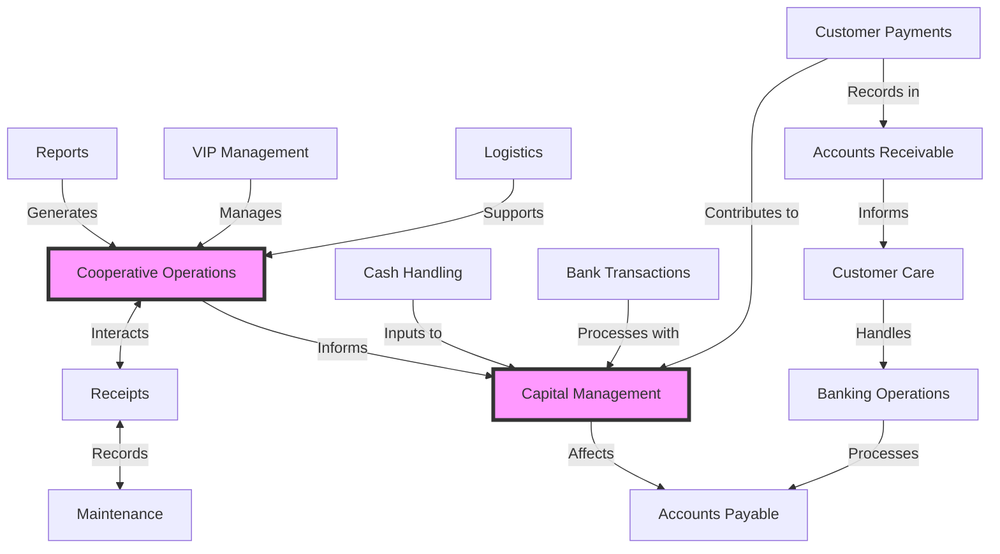

# Kello System Detailed Overview

## Introduction

Kello is a CRM-like application designed to manage business operations, generate automatic reports, handle bank-specific EDI transactions, and create standard SBP payment slips. This document provides a detailed overview of the system's main components, including their interactions and operational flow.

## System Diagram

## Main Components, Interactions, and Flow

### 1. Cooperative Operations
- **Description**: The central hub for core business processes and data management.
- **Interactions**: 
  - Receives input from Reports, VIP Management, and Logistics.
  - Interacts bidirectionally with Receipts.
  - Informs Capital Management.
- **Flow**: Acts as a central point for integrating various business operations and disseminating information to financial management.

### 2. Capital Management
- **Description**: Manages financial resources and investments.
- **Interactions**: 
  - Receives input from Cash Handling, Bank Transactions, and Customer Payments.
  - Receives information from Cooperative Operations.
  - Affects Accounts Payable.
- **Flow**: Centralizes financial data and decisions, influencing overall financial strategy and payables.

### 3. Reports
- **Description**: Generates automatic reports based on system data.
- **Interactions**: Feeds into Cooperative Operations.
- **Flow**: Provides analytical insights to inform operational decisions.

### 4. VIP Management
- **Description**: Handles high-value clients or partners.
- **Interactions**: Feeds into Cooperative Operations.
- **Flow**: Ensures special handling of important clients, informing overall operations.

### 5. Logistics
- **Description**: Manages supply chain and delivery processes.
- **Interactions**: Supports Cooperative Operations.
- **Flow**: Integrates supply chain information into core operations.

### 6. Receipts
- **Description**: Manages transaction records and documentation.
- **Interactions**: 
  - Interacts bidirectionally with Cooperative Operations and Maintenance.
- **Flow**: Ensures proper documentation of transactions and maintenance activities.

### 7. Maintenance
- **Description**: Handles equipment upkeep and related documentation.
- **Interactions**: Bidirectional relationship with Receipts.
- **Flow**: Tracks maintenance activities and associated costs.

### 8. Cash Handling
- **Description**: Manages physical cash transactions.
- **Interactions**: Inputs to Capital Management.
- **Flow**: Ensures physical cash is accounted for in overall financial management.

### 9. Bank Transactions
- **Description**: Handles electronic banking operations.
- **Interactions**: Processes with Capital Management.
- **Flow**: Integrates electronic financial transactions into overall financial picture.

### 10. Customer Payments
- **Description**: Manages incoming payments from customers.
- **Interactions**: 
  - Contributes to Capital Management.
  - Records in Accounts Receivable.
- **Flow**: Ensures proper tracking and allocation of customer payments.

### 11. Accounts Receivable
- **Description**: Tracks money owed to the business.
- **Interactions**: 
  - Receives records from Customer Payments.
  - Informs Customer Care.
- **Flow**: Maintains up-to-date records of incoming payments and outstanding balances.

### 12. Accounts Payable
- **Description**: Tracks money owed by the business.
- **Interactions**: 
  - Affected by Capital Management.
  - Processed by Banking Operations.
- **Flow**: Manages outgoing payments based on financial decisions and banking processes.

### 13. Customer Care
- **Description**: Handles customer inquiries and support related to payments.
- **Interactions**: 
  - Informed by Accounts Receivable.
  - Handles Banking Operations.
- **Flow**: Provides customer support with access to payment information and banking services.

### 14. Banking Operations
- **Description**: Manages specialized banking tasks, including EDI transactions and SBP payment slip generation.
- **Interactions**: 
  - Handled by Customer Care.
  - Processes Accounts Payable.
- **Flow**: Executes specific banking tasks, linking customer service with financial obligations.

## Overall System Flow
The Kello system integrates various business functions seamlessly, with Cooperative Operations and Capital Management serving as central hubs. The flow of information and processes ensures that customer-facing operations are connected with back-end financial management, while also providing tools for reporting and analysis. This integrated approach allows for streamlined business processes, efficient data management, and comprehensive financial control, all while maintaining strong customer relationship management capabilities.
