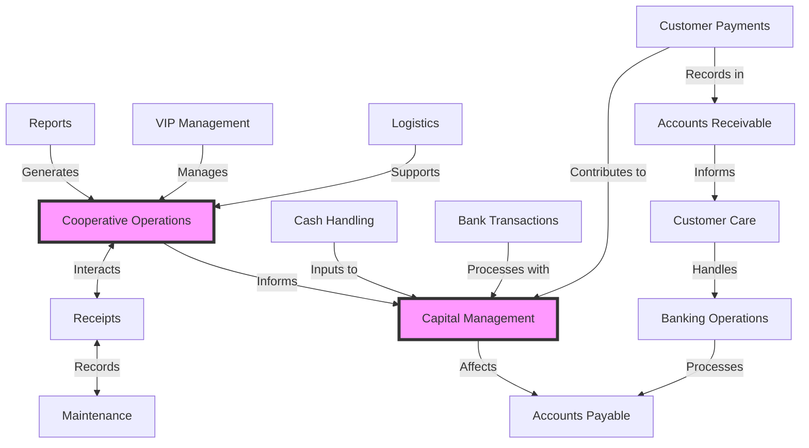

# Kello System Overview

## Introduction

Kello is a CRM-like application designed to manage business operations, generate automatic reports, handle bank-specific EDI transactions, and create standard SBP payment slips. This document provides an overview of the system's main components, their interactions, and the overall flow of operations.

## System Diagram

## Main Components

1. **Cooperative Operations**: The central hub for core business processes and data management.
2. **Capital Management**: Manages financial resources and investments.
3. **Reports**: Generates automatic reports based on system data.
4. **VIP Management**: Handles high-value clients or partners.
5. **Logistics**: Manages supply chain and delivery processes.
6. **Receipts**: Manages transaction records and documentation.
7. **Maintenance**: Handles equipment upkeep and related documentation.
8. **Cash Handling**: Manages physical cash transactions.
9. **Bank Transactions**: Handles electronic banking operations.
10. **Customer Payments**: Manages incoming payments from customers.
11. **Accounts Receivable**: Tracks money owed to the business.
12. **Accounts Payable**: Tracks money owed by the business.
13. **Customer Care**: Handles customer inquiries and support related to payments.
14. **Banking Operations**: Manages specialized banking tasks, including EDI transactions and SBP payment slip generation.

## Interactions and Flow Summary

1. **Core Operations Flow**:
   - Reports, VIP Management, and Logistics feed into Cooperative Operations.
   - Cooperative Operations interacts bidirectionally with Receipts.
   - Cooperative Operations informs Capital Management.

2. **Financial Flow**:
   - Cash Handling, Bank Transactions, and Customer Payments contribute to Capital Management.
   - Customer Payments are recorded in Accounts Receivable.
   - Capital Management affects Accounts Payable.

3. **Customer-Related Flow**:
   - Accounts Receivable informs Customer Care.
   - Customer Care handles Banking Operations.
   - Banking Operations processes Accounts Payable.

4. **Operational Flow**:
   - Receipts and Maintenance have a bidirectional relationship for recording and tracking.

The system is designed to integrate various business functions seamlessly. Cooperative Operations and Capital Management serve as central hubs, interacting with multiple components. The flow of information and processes ensures that customer-facing operations are connected with back-end financial management, while also providing tools for reporting and analysis.

The inclusion of banking-specific features like EDI transactions and SBP payment slips indicates that Kello is tailored for businesses with significant banking interactions, possibly in the financial sector or for companies with complex financial operations.

This integrated approach allows for streamlined business processes, efficient data management, and comprehensive financial control, all while maintaining strong customer relationship management capabilities.
